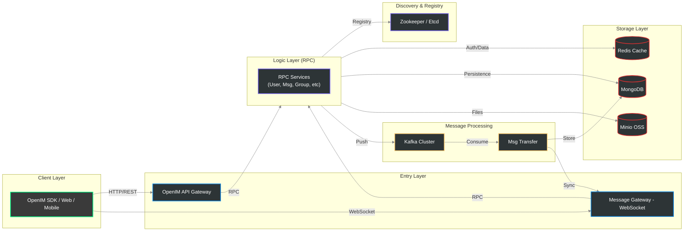

# OpenIM Server Architecture

This diagram illustrates the high-level architecture of OpenIM Server, designed for high-concurrency messaging and real-time communication.

## Architectural Components

### 1. Client Layer
- **OpenIM SDK:** Decouples complex messaging logic from the UI, handling local storage, sequence synchronization, and connection management.

### 2. Entry Layer
- **API Gateway:** Handles RESTful requests, user authentication, and administrative operations.
- **Message Gateway:** Maintains persistent WebSocket connections for real-time message delivery.

### 3. Logic Layer (RPC Services)
- Microservices architecture partitioned by domain (User, Group, Msg, etc.).
- Horizontally scalable and discovered via Zookeeper or Etcd.

### 4. Storage & Processing
- **Kafka:** Decouples message sending from persistence, ensuring high throughput and reliability.
- **Redis:** Used for hot data caching (online status, tokens) and sequence IDs.
- **MongoDB:** Primary store for message history and metadata.
- **Minio:** Handles object storage for images, videos, and voice messages.
